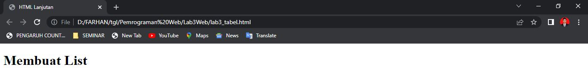
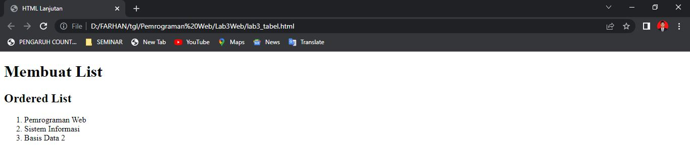

# Lab3Web

_**Tugas Praktikum 3**_

**NAMA      : Muhammad Farhan Alfarizi** 
**KELAS     : TI.20.B1** 
**NIM       : 312010210**

1.**MEMBUAT LIST HTML**

Pada pertemuan kali ini saya akan membuat list tabel 

2.**ORDER LIST**

langkah yang kedua kita masukan order list

3.**UNORDER LIST**

Selanjutnya kita masukan Unorder list

4.**DESCRIPTION LIST**

Tambahkan Description List

* **MEMBUAT TABEL**

Pada point ini, saya akan membuat tabel

* **Menggabungkan sel data**

5.**MEMBUAT FORM**
Pada point terakhir kita membuat form

* **MENAMBAHKAN STYLE PADA FORM**
disini kita akan memodifikasi form agar menjadi lebih menarik dengan cara menambahkan style css

